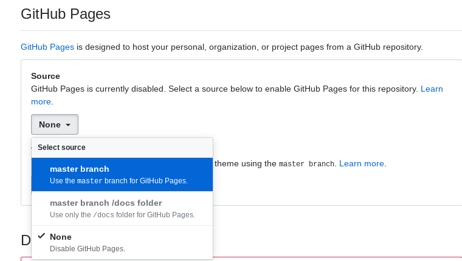

# Setup a quick Github pages site

## Most straightforward - user or organisation site

For a site named after the whole user or organisation Github name. 

This example is for the mightycloud organisation, i.e. https://github.com/mightycloud


### 1. Create a repo ending .github.io on Github.com

This has the format {Github user/org name}.github.io

e.g. mightycloud.github.io

The site will be served at this url by default, e.g.

https://mightycloud.github.io

### 2. Clone the new repo ("*website repo*")

`$ git clone https://github.com/mightycloud/mightycloud.github.io.git`
```
Cloning into 'mightycloud.github.io'...
remote: Enumerating objects: 4, done.
remote: Counting objects: 100% (4/4), done.
remote: Compressing objects: 100% (4/4), done.
remote: Total 4 (delta 0), reused 0 (delta 0), pack-reused 0
Unpacking objects: 100% (4/4), done.
```

### 3. Clone a website starter project

(using the cloudwheels fork of the [Minimal Mistakes Github Starter](https://github.com/mmistakes/mm-github-pages-starter)  )

`$ git clone https://github.com/cloudwheels/mm-github-pages-starter.git`
```
Cloning into 'mm-github-pages-starter'...
remote: Enumerating objects: 67, done.
remote: Total 67 (delta 0), reused 0 (delta 0), pack-reused 67
Unpacking objects: 100% (67/67), done.
nigel@penguin:~$ git clone https://github.com/cloudwheels/TIL.git
```

### 4. Copy all files from the starter project to the website repo 

`$ cp -r mm-github-pages-starter/* mightycloud.github.io`

You can check the files have been copied using:

`$ ls mightycloud.github.io`
```
assets  _config.yml  _data  Gemfile  index.html  LICENSE  _pages  _posts  README.md
```

### 5. Change to website directory, add and commit the files

`$ cd mightycloud.github.io`

`$ git add . && git commit -m "add web starter files"`
```
[master a276783] add web starter files
18 files changed, 520 insertions(+), 2 deletions(-)
create mode 100644 Gemfile
rewrite README.md (100%)
create mode 100644 _config.yml
create mode 100644 _data/navigation.yml
create mode 100644 _pages/404.md
create mode 100644 _pages/about.md
create mode 100644 _pages/category-archive.md
create mode 100644 _pages/tag-archive.md
create mode 100644 _pages/year-archive.md
create mode 100644 _posts/2010-01-07-post-modified.md
create mode 100644 _posts/2010-01-07-post-standard.md
create mode 100644 _posts/2010-01-08-post-chat.md
create mode 100644 _posts/2010-02-05-post-notice.md
create mode 100644 _posts/2010-02-05-post-quote.md
create mode 100644 _posts/2010-03-07-post-link.md
create mode 100644 _posts/2019-04-18-welcome-to-jekyll.md
create mode 100644 assets/images/bio-photo.jpg
create mode 100644 index.html
```

### 6. Push website files to Github

You will need to enter yoiu Github username & password:

`$ git push origin master`
```
Username for 'https://github.com': cloudwheels
Password for 'https://cloudwheels@github.com': 
```
```
Counting objects: 25, done.
Delta compression using up to 2 threads.
Compressing objects: 100% (22/22), done.
Writing objects: 100% (25/25), 11.25 KiB | 0 bytes/s, done.
Total 25 (delta 1), reused 0 (delta 0)
remote: Resolving deltas: 100% (1/1), done.
To https://github.com/mightycloud/mightycloud.github.io.git
   ad81820..a276783  master -> master
```

### 7. Enable github pages for the repo on Github.com 

Navigate to `Github Pages` section in the repo `Settings` page and select master branch.




**TA DA!**

https://mightycloud.github.io

You can now start editing files!

---

## Set up project site

This is for a repo within a Github user or organisation, i.e. github.com{user or org}/{project}.

This example is for the github.com/cloudwheels/TIL repo.

The site will be served at https://cloudwheels.github.io/til.

A project site can either be served from a `docs/` folder on the master branch or a separate branch called `gh-pages`.


## Project site using `/docs` folder on master branch

Using branches can be confusing if you are not familiar with them and may have unintended consequences, so this is probably the easier of the two options for project sites


### 1. Clone exisiting repo (*website repo*) (or setup a new project)


`$ git clone https://github.com/cloudwheels/TIL.git`


### 2. Create a /docs folder 

`$ mkdir TIL/docs`


### 3. Clone & copy starter site to /docs directory

`$ git clone https://github.com/cloudwheels/mm-github-pages-starter.git`

`$ cp -r mm-github-pages-starter/* TIL/docs`

### 4. Change to project directory, add & commit files, push to master branch on Github.com

`$ cd TIL`

`$ git add . && git commit -m "create /docs folder and add website files"`

`$ git push -u origin master` 

### 5. Configure settings on Github.com to serve from /docs folder

**TA DA!**

https://cloudwheels.github.io/til

---

## Project site using `gh-pages` branch

This example if for creating a site for the existing repo on a gh-pages branch.

**Using branches can be confusing if you are not familiar with them and may have unintended consequences**

It may well be easier to publsih the site from a folder (e.g. `docs`) on the master branch.


### 1. Clone exisiting repo (*website repo*) (or setup a new project)


`$ git clone https://github.com/cloudwheels/TIL.git`


### 2. Clone a website starter project (as above)

(using the cloudwheels fork of the [Minimal Mistakes Github Starter](https://github.com/mmistakes/mm-github-pages-starter)  )

`$ git clone https://github.com/cloudwheels/mm-github-pages-starter.git`


### 3. Change to website repo directory & create a new `gh-pages` branch

`$ cd TIL`

`$ git checkout -b gh-pages`
```
Switched to a new branch 'gh-pages'
```

### 4. Change back to previous directory

Doing this for safety to avoid wiping files in the next step!!!

`$ cd ..`


### 5. Remove existing content from the gh-pages branch


**CAUTION - using the `-f` `force` option with `rm` can have unintended consequences!**

`$ rm -rf TIL/*`


### 5. Copy starter files (as above)

As above but NOTE: you are in destination directory & source directory now one level above!

`$ cp -r mm-github-pages-starter/* TIL`

[check it worked]

`$ ls TIL`
```
assets  _config.yml  _data  Gemfile  index.html  _pages  _posts  README.md
```

### 6. Change to directory, add & commit files, push GH-PAGES BRANCH

`$ cd TIL`

`$ git add . && git commit -m "add website files to gh-pages"`

*Using push with the -u option associates this local gh-pages branch with the remote one on github.com*

`$ git push -u origin gh-pages` 
```
Username for 'https://github.com': cloudwheels
Password for 'https://cloudwheels@github.com': 
Counting objects: 25, done.
Delta compression using up to 2 threads.
Compressing objects: 100% (22/22), done.
Writing objects: 100% (25/25), 11.23 KiB | 0 bytes/s, done.
Total 25 (delta 1), reused 0 (delta 0)
remote: Resolving deltas: 100% (1/1), done.
remote: 
remote: Create a pull request for 'gh-pages' on GitHub by visiting:
remote:      https://github.com/cloudwheels/TIL/pull/new/gh-pages
remote: 
To https://github.com/cloudwheels/TIL.git
 * [new branch]      gh-pages -> gh-pages
Branch gh-pages set up to track remote branch gh-pages from origin.
```

**TA DA!**

Github automatically recognises `gh-pages` branch as the source of a site and builds the pages

https://cloudwheels.github.io/til


